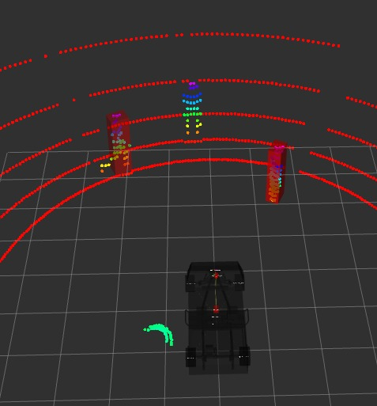
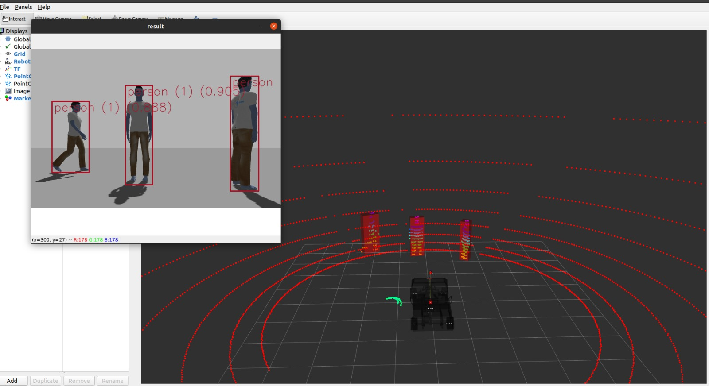
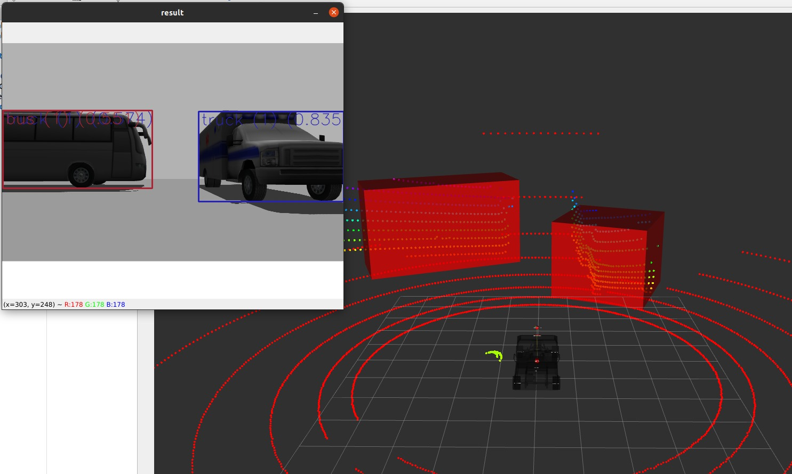

# cBarredez portafolio
A resume of my jobs during my university and my own projects.

Name: Carlos Andres Barredez Rios

Nationality: Mexican/Argentinian (born place)

Date of Birth: August 13, 1999

University Degree: Engineering in Digital Systems and Robotics (currently enrolled) at Tecnologico de Monterrey

Languages: Spanish (native), English (intermediate-advanced), German (intermediate)

Some completed projects, both academic and independent:

Challenge: Autonomous Vehicle Navigation

Document link: https://1drv.ms/b/s!ApGh7mKrYeL4ghMZE2Qb_y6ajybr?e=3xSaXW

video: https://www.youtube.com/watch?v=C7mRzIKXyRk

ROLA Autonomous Systems

 
